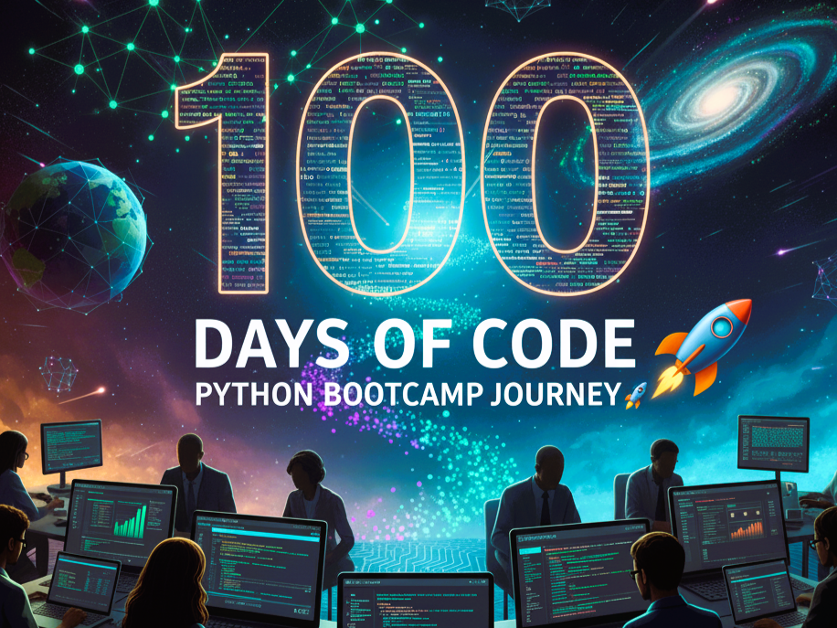

<h1 align="center">100 Days of Code: Python Bootcamp Journey 🚀</h1>

A personal journey inspired by **Dr. Angela Yu's "100 Days of Code: The Complete Python Pro Bootcamp"** on Udemy.  
This repository documents my progress — from **beginner to advanced Python projects**.

---

## 🔰 Beginner Level
- [Day 1:](https://dummy.link/day1) Working with Variables in Python to Manage Data  
- [Day 2:](https://dummy.link/day2) Understanding Data Types and Manipulating Strings  
- [Day 3:](https://dummy.link/day3) Control Flow and Logical Operators  
- [Day 4:](https://dummy.link/day4) Randomisation and Python Lists  
- [Day 5:](https://dummy.link/day5) Python Loops  
- [Day 6:](https://dummy.link/day6) Python Functions & Karel  
- [Day 7:](https://dummy.link/day7) Hangman Game 🎯  
- [Day 8:](https://dummy.link/day8) Function Parameters & Caesar Cipher  
- [Day 9:](https://dummy.link/day9) Dictionaries, Nesting and the Secret Auction  
- [Day 10:](https://dummy.link/day10) Functions with Outputs  
- [Day 11:](https://dummy.link/day11) Blackjack Capstone Project 🃏  
- [Day 12:](https://dummy.link/day12) Scope & Number Guessing Game  
- [Day 13:](https://dummy.link/day13) Debugging and Fixing Errors  
- [Day 14:](https://dummy.link/day14) Higher or Lower Game  

---

## 📚 Intermediate Level
- [Day 15:](https://dummy.link/day15) Coffee Machine Project ☕  
- [Day 16:](https://dummy.link/day16) Object-Oriented Programming (OOP)  
- [Day 17:](https://dummy.link/day17) The Quiz Project & OOP Concepts  
- [Day 18:](https://dummy.link/day18) Turtle Graphics and GUI Basics  
- [Day 19:](https://dummy.link/day19) State, Instances and Higher Order Functions  
- [Day 20:](https://dummy.link/day20) Snake Game Part 1: Animation & Coordinates 🐍  
- [Day 21:](https://dummy.link/day21) Snake Game Part 2: Inheritance & Slicing  
- [Day 22:](https://dummy.link/day22) Pong Game 🎮  
- [Day 23:](https://dummy.link/day23) The Turtle Crossing Capstone Project  
- [Day 24:](https://dummy.link/day24) Files, Directories and Paths  
- [Day 25:](https://dummy.link/day25) Working with CSV Data using Pandas  
- [Day 26:](https://dummy.link/day26) List Comprehension and NATO Alphabet  
- [Day 27:](https://dummy.link/day27) Tkinter GUI Basics — *args and **kwargs  
- [Day 28:](https://dummy.link/day28) Pomodoro Timer App  
- [Day 29:](https://dummy.link/day29) Password Manager GUI  
- [Day 30:](https://dummy.link/day30) JSON & Error Handling — Upgraded Password Manager  
- [Day 31:](https://dummy.link/day31) Flash Card App Capstone  

---

## 👨‍💻 Intermediate+ Level
- [Day 32:](https://dummy.link/day32) Automated Birthday Email Sender (SMTP & Datetime)  
- [Day 33:](https://dummy.link/day33) ISS Overhead Notifier using APIs  
- [Day 34:](https://dummy.link/day34) GUI Quiz App using API Data  
- [Day 35:](https://dummy.link/day35) Rain Alert via Telegram API  
- [Day 36:](https://dummy.link/day36) Stock Price Alert App  
- [Day 37:](https://dummy.link/day37) Habit Tracking using API POST Requests  
- [Day 38:](https://dummy.link/day38) Workout Tracker with Google Sheets  
- [Day 39–40:](https://dummy.link/day40) Flight Deal Finder (Capstone Project) ✈️  
- [Day 41–44:](https://dummy.link/day41) HTML & CSS for Web Dev Foundation  
- [Day 45–47:](https://dummy.link/day45) Web Scraping with BeautifulSoup & Selenium  
- [Day 48–50:](https://dummy.link/day48) Automation Bots (LinkedIn, Tinder, Amazon)  
- [Day 51–53:](https://dummy.link/day51) Web Scraping Automation Project  

---

## 🏆 Advanced Level
- [Day 54–57:](https://dummy.link/day54) Flask — Templates, Routes, and Jinja2  
- [Day 58–60:](https://dummy.link/day58) Flask Forms & Bootstrap Integration  
- [Day 61–63:](https://dummy.link/day61) Databases with SQLite and SQLAlchemy  
- [Day 64–67:](https://dummy.link/day64) Flask REST APIs and Blog Capstone  
- [Day 68–70:](https://dummy.link/day68) Authentication & Deployment (Heroku, Gunicorn)  
- [Day 71–80:](https://dummy.link/day71) Data Science with Pandas, NumPy, Matplotlib & Seaborn  

---

## ⚔ Professional Portfolio Projects
- [Day 81:](https://dummy.link/day81) Text to Morse Code Converter  
- [Day 82:](https://dummy.link/day82) Personal Portfolio Website 🌐  
- [Day 83:](https://dummy.link/day83) Tic Tac Toe Game  
- [Day 84:](https://dummy.link/day84) Image Watermarking App  
- [Day 85:](https://dummy.link/day85) Typing Speed Test App  
- [Day 86:](https://dummy.link/day86) Breakout Game  
- [Day 87:](https://dummy.link/day87) Cafe & Wi-Fi Website  
- [Day 88:](https://dummy.link/day88) To-Do Agenda App  
- [Day 89:](https://dummy.link/day89) Disappearing Text App  
- [Day 90:](https://dummy.link/day90) PDF to Audiobook Converter  
- [Day 91–100:](https://dummy.link/day91) Final Data Analytics & Machine Learning Projects  

---

## ⚙ Tools and Technologies Covered
- **Python 3**, PyCharm, Jupyter Notebook, Google Colab  
- **Core Python**: Variables, Data Types, Loops, Functions  
- **OOP Concepts** and **Modules**  
- **Data Handling:** CSV, JSON, Pandas  
- **APIs** and **Automation (Selenium, BeautifulSoup)**  
- **Tkinter GUI Development**  
- **Web Development:** HTML, CSS, Bootstrap, Flask  
- **Databases:** SQLite, PostgreSQL  
- **Data Science:** NumPy, Matplotlib, Seaborn, Plotly  
- **Version Control:** Git, GitHub  
- **Deployment:** GitHub Pages, Heroku, Gunicorn  

---

## 🌟 Connect with Me 
🌐 **GitHub:** [github.com/AishwaryaTS-cloud](https://github.com/AishwaryaTS-cloud)  
💼 **LinkedIn:** [linkedin.com/in/Aishwarya-T-S](https://www.linkedin.com/in/aishwarya-t-s-61b3b4354/)

> “Code, Learn, and Build — One Day at a Time 💻🔥”

---
